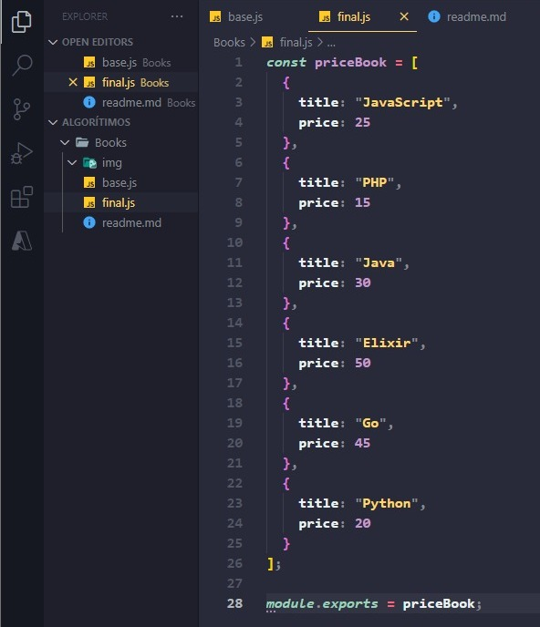
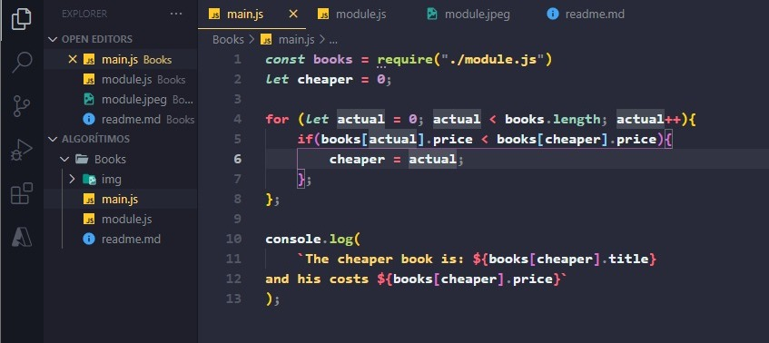
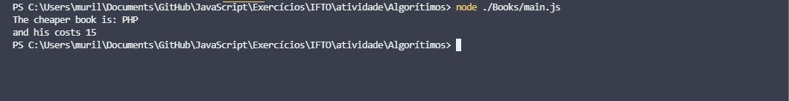

# Books 📘

 Let's say we get a gift card at a bookstore for X, say, fifty reais, one hundred reais, and we want to get that gift card in programming books...

Nós entramos no site da livraria, procuramos por livro de programação, e recebemos algumas opções. Só que o site da livraria trouxe para nós essas opções – um livro de JavaScript (25,00), um livro de PHP (R$ 15,00), um livro de Java (R$ 30,00), Elixir (50,00), Go (R$ 45,00) e   Python (R$ 20,00) – que não estão em nenhuma ordem particular que consigamos ver.
Oque podemos comprar com o nosso dinheiro? Para conseguirmos saber isso, temos que saber quais são os livros mais baratos, como eu consigo somar etc.

# 

- First, since we're dealing with a comparison of objects in an array, let's do it literally! We are going to impose an array with all the books being objects with a title and price, thus helping it further with more specific situations and making it more manageable and simple to understand.

- That established, we now need to use this own array of free objects as a direct module for our algorithm. It just uses the export module command. Once we've set this up, we'll make sure these objects can be exported wherever they're called, using the file only as a component of our main code!

# 

# 

- Right at the beginning of the code, we have already imported our book module, and so we only use its properties, and so depending on what can be placed there, already comparing its values and displaying it inside the console, as requested! Note that now we don't use variables directly, since we simply have an object with all the properties, we just put them as a parameter.

- And so then we simply need to ask the console to display the parameters of the book title and its price already passed through the entire algorithm...

# 

 
 
 

#
