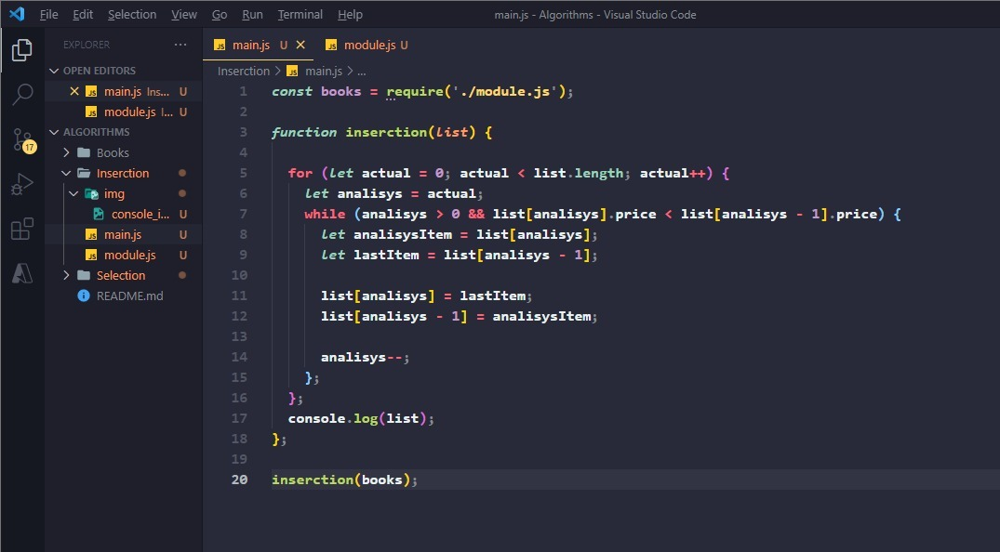
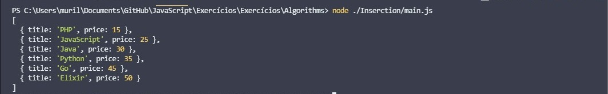

# Inserction Sort 📕

**In the `selectionSort`, for every index, for every item that we parse, you have to go through the whole list to the end and see if you swap any items or not. So, if the list has a thousand items, it goes to the end of the thousand items! And what we did now, when we sorted out our bookcase, was a little different.**

**We inserted the element in the space where it should be analyzing what came before, if it was in the right position, and what came after.**

**Let's start:**

--- 

--- 

- In the insection sort method, we use a slightly different way to coordinate the list! Where first let's go through a double repeat list! That is, it will make a `while` conditional do the work of comparing the array's prices and their names, and coordinating them, and the `for` list will usually coordinate the size than the amount of times this code will be delivered to the array.

- Inside the while, we use repetition starting with an analysis variable, the same used inside the for to make the counting part of the array size... Starting in the while we already use the variable that is above index 0, since if pass it, we won't be able to compare with anything, since it's the first index of our array! And just like that, we just use the index and compare it with the previous one, and so we enter the code block.

- Inside the code block, the same scheme as in selection sort is used, so the variables are rewritten with the swapped positions, as long as the conditional of the while is respected!

### And this is the result on the console:

--- 

--- 