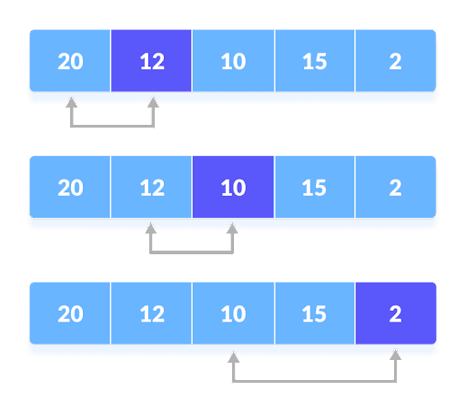
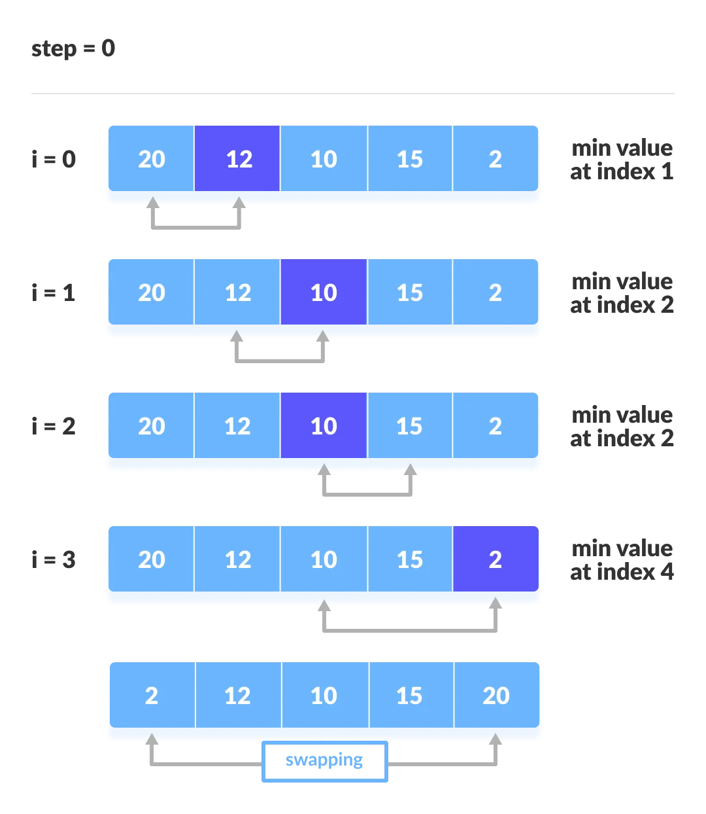
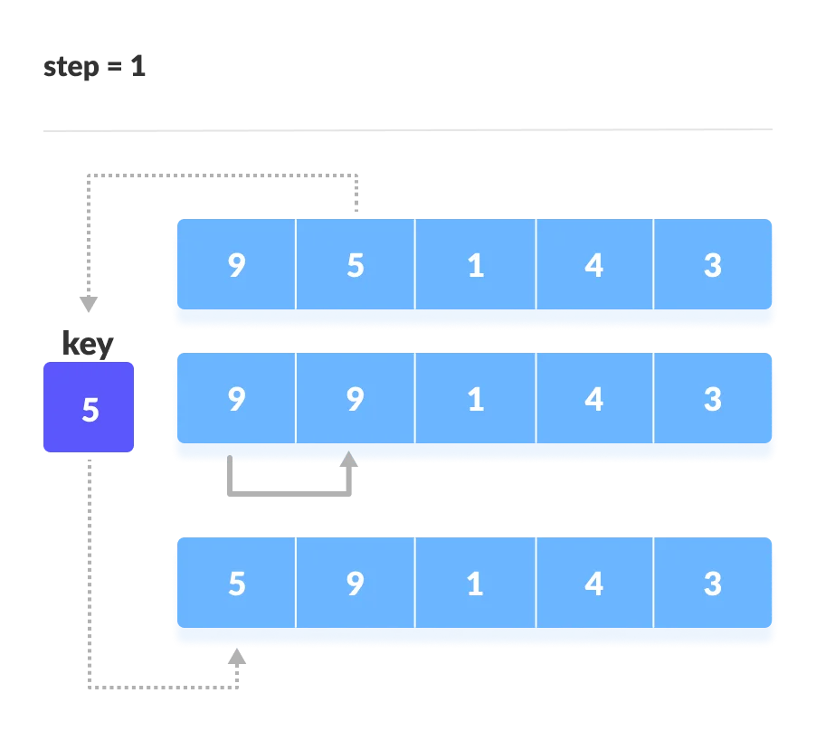
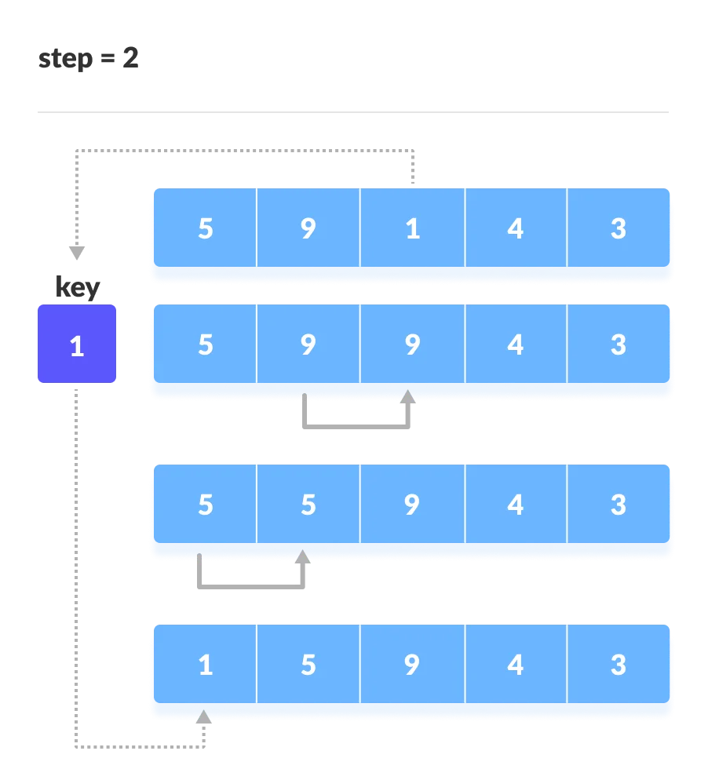
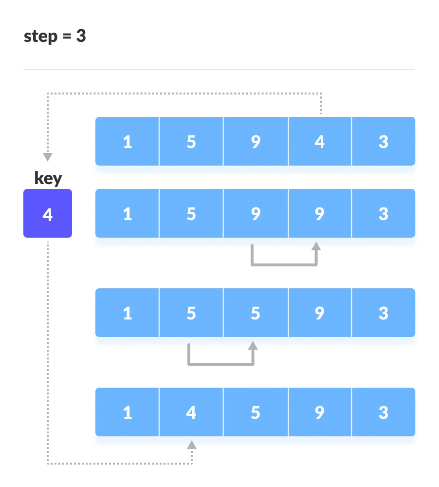
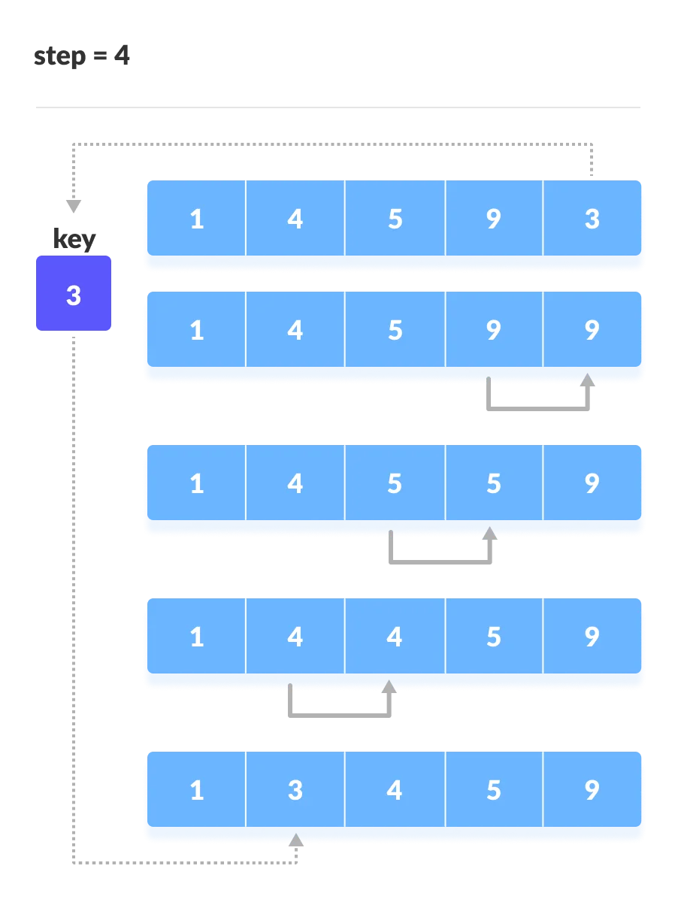

# Algorithms 📒

### - Algorithms are finite sequences of logical steps to solve a problem and that can represent both common problems in programming and any situation involving logical steps!

### Take advantage of all the problems below, with practical situations for all types! These situations will be given in JavaScript, have fun and learn! ;)

# 

## Diference in Algorithms methods...
>  If you want to know more about, see: [https://www.programiz.com/dsa/selection-sort](https://www.programiz.com/dsa/selection-sort) 
>

>[https://www.programiz.com/dsa/insertion-sort](https://www.programiz.com/dsa/insertion-sort)

### `Selection Sort:`

- It's a for, it's a loop loop that will loop through all the elements of a list, no matter how long the list is. So if it's a list of a thousand elements, it's going to make this one a thousand times.

- It will change the initial because it will iterate changing the initial of index 0, to index 1, to index 2 and to index 3 onwards, but even so, this force will still run a thousand times for an array of thousand, ten thousand to an array of ten thousand, six times to an array of six elements, as we did. Inside the  for block, there is another block that is a conditional, it is an  if, it is an “if”. The code inside the ifis only executed if the do if condition is true, that is, we can say that, for each loop, for each loop, it may or may not enter inside the ifdepending on the element we are analyzing.

# 

# 

# 
 If we were to pass what we said now to a form that we can calculate, we can say that, in a list of six elements, we will have between six operations - because entering the '*for*' is already an operation - and twelve operations, because we don't know if , for each element, will enter or not  *if*. In other words, within a list of 1000 items, around 2000 operations can be performed with exchanges of previous values, and analyzing each one by one from index 1!

This getting worse and making the entire code scope of the algorithm a little slow and unperforming!
# 

### `Insection Sort:`

>  If you want to know more about, see: [https://www.programiz.com/dsa/selection-sort](https://www.programiz.com/dsa/selection-sort) 
>

>[https://www.programiz.com/dsa/insertion-sort](https://www.programiz.com/dsa/insertion-sort)

 We assume that the first card is already sorted then, we select an unsorted card. If the unsorted card is greater than the card in hand, it is placed on the right otherwise, to the left. In the same way, other unsorted cards are taken and put in their right place.

 - The first element in the array is assumed to be sorted. Take the second element and store it separately in key. Compare key with the first element. If the first element is greater than key, then key is placed in front of the first element.

 #
 

# 

- Take the third element and compare it with the elements on the left of it. Placed it just behind the element smaller than it. If there is no element smaller than it, then place it at the beginning of the array.
#
 

# 

- Similarly, place every unsorted element at its correct position.

#
 

# 

#
 

# 