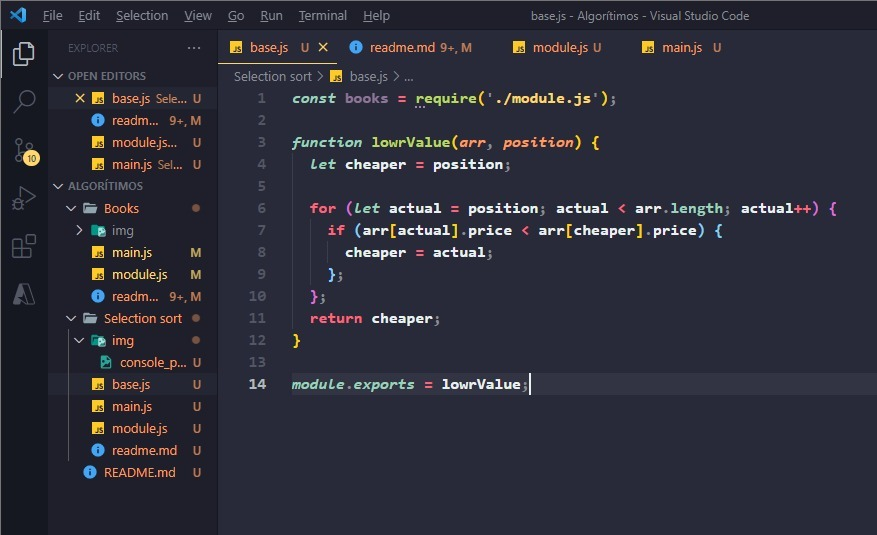
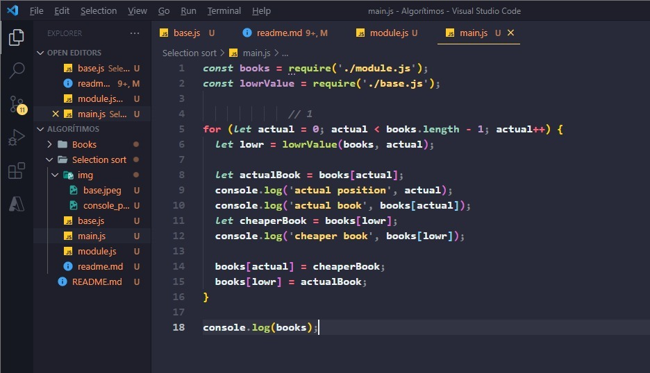
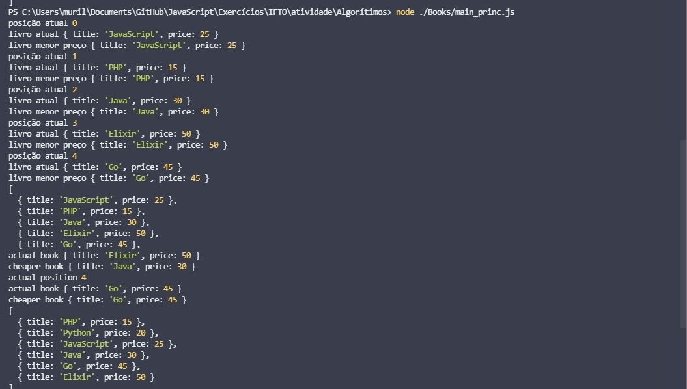

# Refactoring the function 📑

We've already seen that sometimes it's worth sorting a list to get the first two, the first, the top three, and so on. So what we're going to do now is build in the code more or less the same steps we did before but now reworking it and doing it with a selection sort.

The sort() method sorts the elements of the array itself and returns the array. The ordering is not necessarily stable. The default ordering is according to the unicode code score.

The runtime complexity or the amount of memory used by ordering cannot be guaranteed and depends on the implementation performed.

You can better see how the method works at: https://developer.mozilla.org/en-US/docs/Web/JavaScript/Reference/Global_Objects/Array/sort
# 

- Firstly, we've already created a function that does this, which will make itself the basis of the entire reconstitution of this array, and so it will start with two parameters that will now be used as the variable types inside the loop, and also with the conditionals. Since it's a function, we also don't need it to ask to be displayed on the console, we simply ask it to return directly...

# 

# 

Now, let's go to exibition function! Well, that function will be our display function! It will basically be used as part of an explanation within the console of the ordering of our array of books... First we import the two other module and base function files!

- We create a repeating list pattern with a position variable within the array, which will start with 0, the starting position of the array. Afterwards, we simply create a structure of variables, in which they will be used to take the whole process of the base function, in which it will make the display inside the console, with all the steps that the base did! Thus imposing your step by step from the initial position, thus going through all of them and already ordering.

- And right at the end we only display the entire array of books that are already sorted! And that was the result:

# 

# 

### - And this And that was the result of displaying on console:

# 